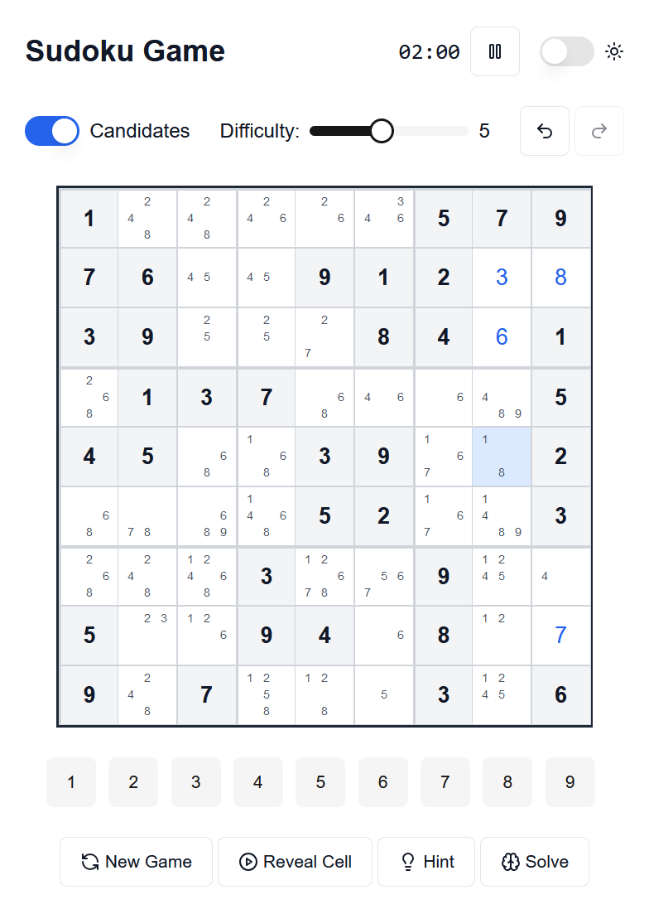
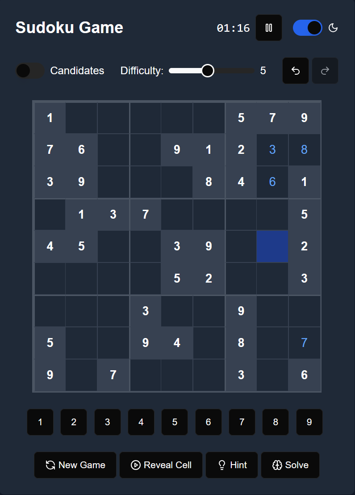

# Sudoku Game
This is a full-featured the Sudoku Game created using React.
The game uses shadcn/ui components for consistent styling and Lucide icons for the buttons. The board state management is handled through React useState hooks, with separate tracking for the original board, current state, and move history.

|  |  |
|---------|---------|
|  |  |


## Features

### Difficulty Levels
Users can adjust difficulty from 1-10 using a slider. Higher difficulties create more empty cells.

### Game Controls

- Undo/Redo functionality with history tracking
- Auto-solve feature
- New game generation
- Number input buttons

### Auto Candidates Mode:

Toggle switch to enable/disable
Shows all possible numbers for empty cells
Updates dynamically as the board changes
Small grid layout for candidates within cells

### Reveal Cell Button:

- Reveals the correct value for the selected cell
- Only works on empty cells
- Adds the move to the history for undo/redo support

### Timer and Pause Feature:

- Displays time in MM:SS format
- Pause/Resume button
- Stylish modal dialog when paused
- Timer stops when game is paused

### Hint System:

- Highlights the cell with the least candidates
- Temporary highlight effect (2 seconds)

### Dark Mode:

- Toggle between light and dark themes
- Affects all UI components
- Smooth transition effects
- Consistent styling across all elements

### Game Logic:

- Validity checking for moves
- Conflict highlighting in red
- Original cells are grayed out and immutable
- Selected cell highlighting

### UI Features:

- Clean, modern design using Tailwind CSS
- Responsive grid layout
- Visual feedback for interactions

### User Experience:

- Clear visual hierarchy
- Intuitive controls
- Immediate feedback on invalid moves


## if you want to setup the game 
### Step 1: Create a New Next.js Project
```bash
# Create a new Next.js project with App Router and Tailwind CSS
npx create-next-app@latest sudoku-game --typescript --tailwind --app
cd sudoku-game
```

### Step 2: Install Required Dependencies
```bash
# Install shadcn/ui CLI
npm install -D @shadcn/ui

# Initialize shadcn/ui
npx shadcn@latest init

# Install required dependencies
npm install lucide-react
```

### Step 3: Install Required shadcn/ui Components
```bash
# Install the components we use in the game
npx shadcn@latest add button
npx shadcn@latest add slider
npx shadcn@latest add switch
npx shadcn@latest add dialog
npx shadcn@latest add label
```

### Step 4: Create the Game Component
Create a new file at components/sudoku-game.tsx and copy paste code

### Step 5: Run the Development Server
```bash
npm run dev
```
The game should now be running at `http://localhost:3000`

## Troubleshooting
1. If you see TypeScript errors:
   - Make sure all dependencies are properly installed
   - Try running `npm install` again
   - Check that all imports are correct

2. If styles are not applying:
   - Make sure Tailwind CSS is properly configured (`tailwind.config.ts`)
   - Check that all class names are correct
   - Try clearing your browser cache

3. If components are not rendering:
   - Verify that all shadcn/ui components are properly installed
   - Check the browser console for any errors
   - Make sure you're using the client component directive (`'use client'`) where needed

## Additional Notes
- The game uses local state management through React hooks. No additional state management library is required.
- The game is fully responsive and works on both desktop and mobile devices.
- Dark mode persistence is handled through CSS classes and local state.
- All game logic is contained within the main component for simplicity.
